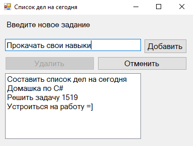

# LimitedSizeStack
LimitedSizeStack - это исключительно учебный проект, реализованный на платформе .NET с использованием WinForms. Программа представляет собой реализацию стека с ограниченной емкостью, который может быть использован для хранения элементов в порядке добавления. Программа разработана с целью показать, как можно использовать стек для решения задач.

Основная цель - показать принципы работы со стеком. Программа имеет простейший интерфейс, который представляет собой список дел, в который можно добавлять новые элементы, удалять существующие или отменять последнее действие.

# Скриншоты

